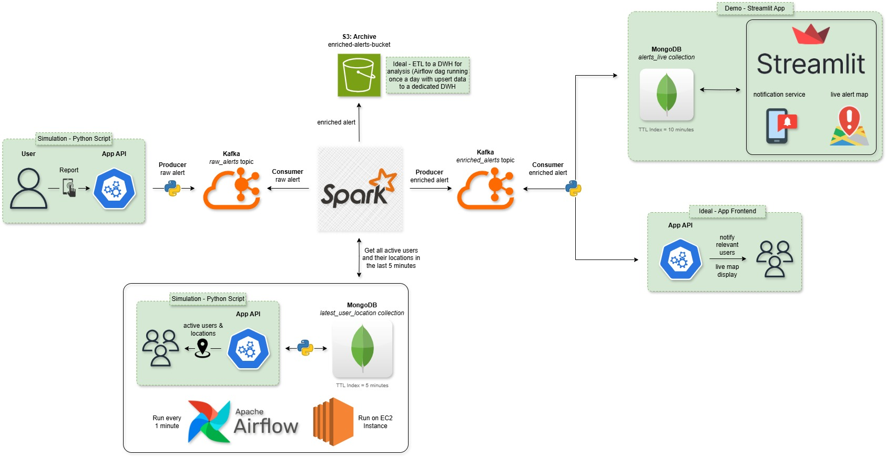
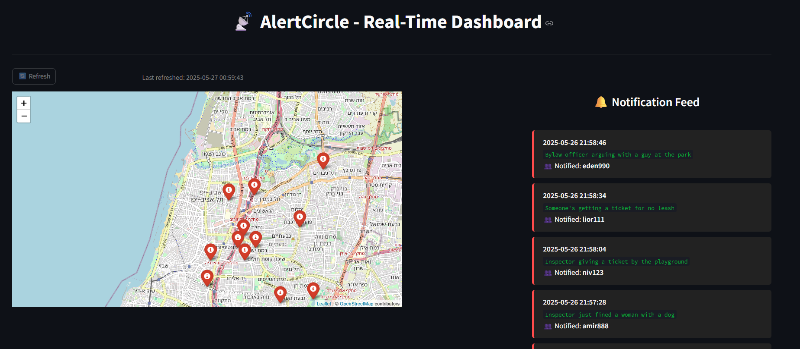

# 🚨 AlertCircle – Real-Time Community Alert System for Bylaw Enforcement Activity

AlertCircle is a real-time, location-based alert system that allows users to report several sightings — such as officers issuing tickets — and instantly notify others nearby. Designed for community-driven awareness, it leverages Apache Kafka, Spark, MongoDB, Airflow, and AWS to deliver alerts, with live map, and a notification feed.




---

## 🧠 Project Highlights

- ⚡ **Real-time stream processing** using Apache Kafka and Spark  
- 🌍 **Location-based enrichment** with MongoDB geospatial queries  
- ⏱️ **Airflow DAG** running every minute to simulate active users  
- 💾 **Amazon S3 integration** for archiving enriched alerts  
- 🗺️ **Streamlit dashboard** for live map and alert feed  
- ☁️ **Hybrid architecture** with EC2 and local services  

---

## 📂 Project Structure

```
AlertCircle/
│
├── airflow/                  # Airflow DAGs
    └── update_user_locations.py
│   └── dags/
│       └── update_user_locations_dag.py
│
├── kafka/                    # Kafka producers and consumers
│   └── user_report_simulator.py
│   └── enriched_alerts_to_mongo.py
│
├── spark/                    # Spark structured streaming job
│   └── process_alerts_stream.py
│
├── streamlit_app/            # Streamlit real-time dashboard
│   └── streamlit_live_map_app.py
│
├── requirements.txt          
├── README.md                 
└── .gitignore
```

---

## ⚙️ Component Overview

### 🧍 User Alert Simulation (Producer)

- Simulated users send alerts every **10 seconds**
- Published to Kafka topic: `raw_alerts`

### 🔥 Spark Enrichment (Stream Processor)

- Consumes `raw_alerts`
- Enriches alerts with nearby users from MongoDB within 500 meters from the alert point
- Publishes to:
  - Kafka topic: `enriched_alerts`
  - S3 bucket: `enriched-alerts`

### 🌐 Airflow DAG (on EC2)

- Runs every **1 minute**
- Simulates active users and locations
- Writes to MongoDB: `latest_user_location` (TTL = 5 minutes)

### 📥 Enriched Alert Consumer

- Consumes from `enriched_alerts`
- Writes to MongoDB: `alerts_live` (TTL = 10 minutes)

### 🗺️ Streamlit Dashboard

- Connects to `alerts_live` MongoDB collection
- Shows:
  - Real-time **alert map** for visualize
  - Live **notification feed** for users notifications simulation



---

## 🚀 Quickstart
---

## 🐳 Docker Deployment (for EC2)

If you're deploying the backend infrastructure on an EC2 instance, you can use Docker Compose for setup.

### 🔧 1. Prerequisites on EC2

Make sure your EC2 has:
- Docker installed
- Docker Compose installed
- The `docker-compose.yaml` file cloned in the project root

### ▶️ 2. Start Services

```bash
cd alertcircle
docker compose up -d
```

This will start:
- Kafka & Zookeeper
- MongoDB
- Airflow (webserver + scheduler + PostgreSQL)
- `dev_env` container for development

---

✅ After the containers are running:
- Airflow UI will be accessible via `http://<your-ec2-public-ip>:8082`
- MongoDB and Kafka will be available to local services (ensure security group allows connections)

---

---

## 🍃 MongoDB Setup (Indexes & TTL)

MongoDB collections and indexes must be created before the system can function properly.

### 🛠️ Initialization Script

A Mongo shell script is provided to create:

- The `AlertCircleProject` database
- Two collections: `alerts_live` and `latest_user_location`
- All required indexes:
  - TTL indexes for automatic cleanup
  - 2dsphere geospatial indexes
  - Optional compound indexes for performance

### 📄 Script File

The script is called `init_alertcircle_db.js` and is located in the root of this repository.

### ▶️ How to Run

From inside your EC2 or Mongo shell:

```bash
mongo < init_alertcircle_db.js
```

---

### 🛠️ Requirements

- Python 3.10+
- Kafka + Zookeeper running
- MongoDB running
- AWS credentials if writing to S3

### 📦 Install Dependencies

```bash
pip install -r requirements.txt
```

### ▶️ Run the System

#### 1. Start the Alert Producer

```bash
python kafka/user_report_simulator.py
```

#### 2. Run Spark Stream Processor

```bash
python spark/process_alerts_stream.py
```

#### 3. Start the Enriched Alert Consumer

```bash
python kafka/enriched_alerts_to_mongo.py
```

#### 4. Launch the Streamlit Dashboard

```bash
streamlit run streamlit_app/streamlit_live_map_app.py
```

> ✅ Airflow is already running on EC2 and updating user locations every minute.

---

## 🧭 Hybrid Deployment Notes

Due to local hardware limitations, this system uses a hybrid deployment model:

- **EC2 instance** hosts:
  - MongoDB
  - Apache Airflow (scheduling DAG)
  - Kafka & Zookeeper
- **Local machine** runs:
  - Spark job for stream processing
  - Kafka producers and consumers
  - Streamlit live dashboard

---

## 📈 Future Enhancements

- [ ] Developing a mobile app based on this project as a backend
- [ ] Setting up fully on EC2 with Docker
- [ ] Expanding alerts options to additional types such as parking inspector
- [ ] User authentication & notification preferences
- [ ] Historical data analytics with AWS Athena/ETL to a DWH -> BI Tool for dashboards
- [ ] Adding tests, error handling, logs, failure plans
---

## 📬 Contact

Maintained by [Nivshitz](https://github.com/Nivshitz)  
For feedback, questions or collaboration – feel free to reach out!

---

🛡️ Built as a final project for the Cloud & Big Data Engineering course @ Naya College

---

